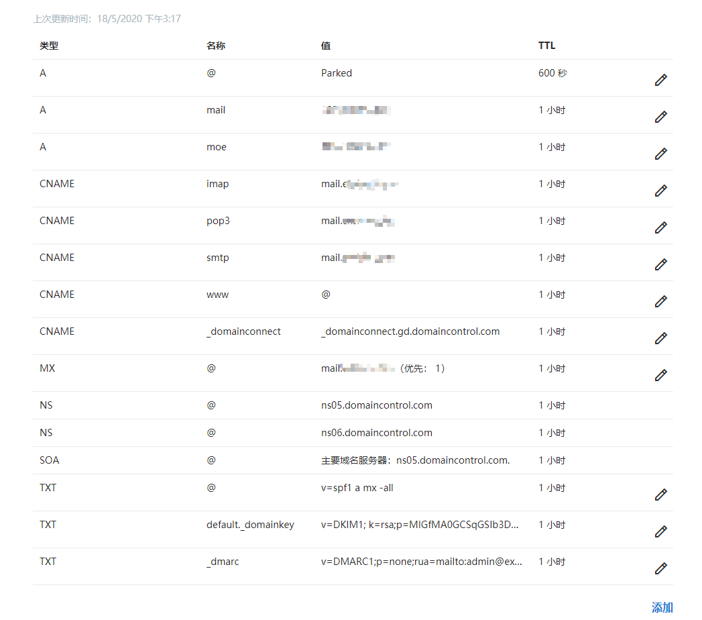
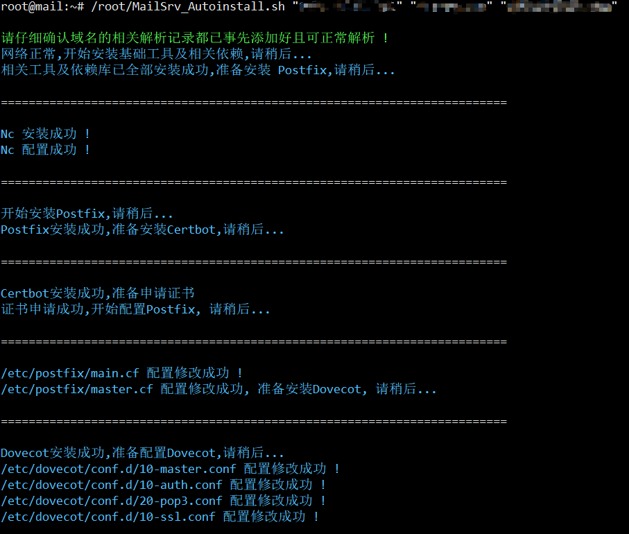
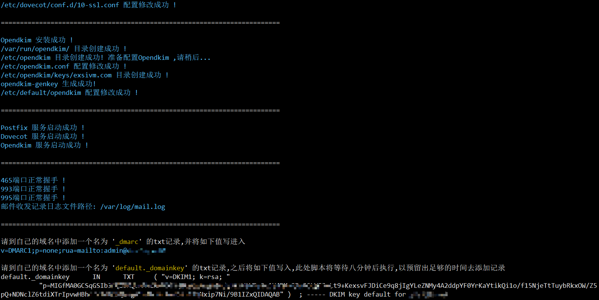
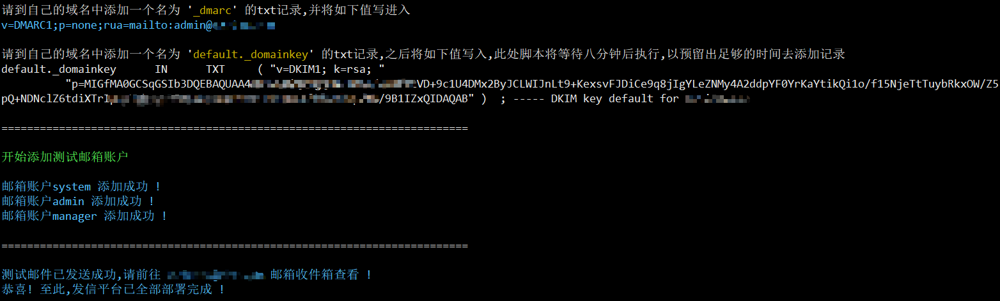
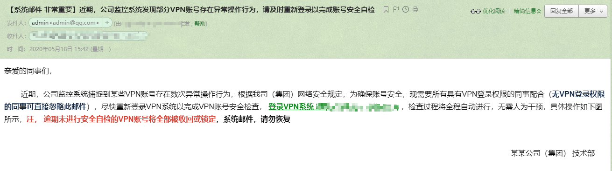

##  0x01 前言
```
为什么要自己搭邮服发信 

第一,灵活方便,随用随搭,一旦上了有价值的目标之后就立即销毁,相对目标自身的实际价值来讲,这个成本并不算非常高,只有在用的时候才把邮件服务开起来,不用的时候就关掉
第二,全程可控,用各种第三方邮服去代发的问题就在于你根本不知道别人到底在后端做了啥(但你做了啥,别人却看的一清二楚),当然,不仅仅只是这一个方面
第三,把这个再稍微延申扩展下,比如,写个漂亮的GUI套上,转身一变其实就是个很好的开源钓鱼平台

等等等等等等....不再赘述
```

## 0x02 部署前准备
```
首先,去申请一个近似域名(即跟目标相似度最高的域名,不建议用伪造,通常都会直接被各种邮件网关拦掉),然后再到域名里去添加好如下记录

一条名为mail的A记录,指向 vpsip
一条MX记录 @ ,指向 mail.yourdomain.com,优先级1
一条名为smtp的CNAME记录,指向mail.yourdomain.com
一条名为pop3的CNAME记录,指向mail.yourdomain.com
一条名为imap的CNAME记录,指向mail.yourdomain.com
一条txt记录, @ 值为 v=spf1 a mx -all
```

## 0x03 VPS上执行初始操作
```
# passwd
# echo "mail.yourdomain.com" > /etc/hostname
# echo yourvpsip mail.yourdomain.com >> /etc/hosts
# shutdown -r now
# 之后,等上大概个半小时左右(其实可能要不了这么久),主要是为了等域名解析记录生效,之后再开始执行该脚本

详细确认您的VPS厂商是否允许所有邮件服务端口正常通信(安全组是否已放开相关邮件服务端口)
很多厂商为了避免vps被用来滥发垃圾邮件而导致ip被标记,默认会直接禁掉25端口通信
最后,再仔细确认下自己的VPS IP和域名曾经是否进过各种黑名单,比如,曾经被人用来做过C2,RAT域名,发过垃圾邮件 等等等...这些问题后续都会严重影响邮件的实际送达率
```

## 0x04 脚本最终会部署的环境
```
包括 Certbot + Postfix + Dovecot + Opendkim ...

时间仓促,脚本写的并不是很精细,有空的话,可以把所有的前期检测及服务起停动作都可以写成函数进行调用,方便一些
```

## 0x05 最终实际部署效果





